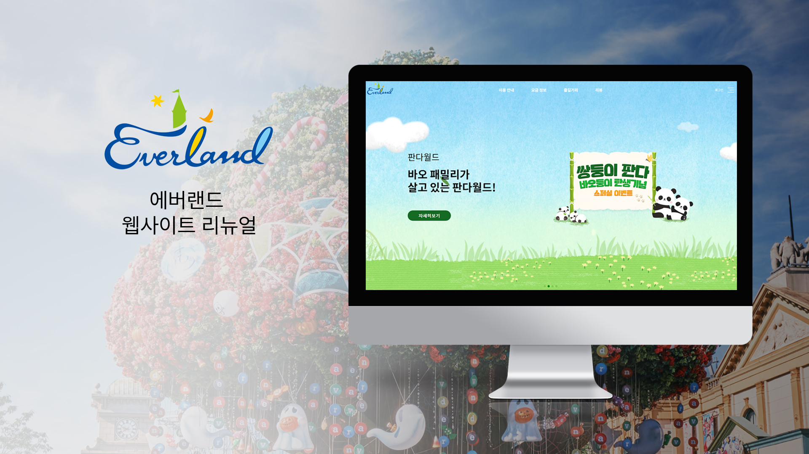

# Teamd-Project - everland
기존의 에버랜드 홈페이지는 제공하는 정보량이 많고, UI가 사용자가 원하는 정보를 얻기에 어려움이 있다고 판단하여 사용자가 필요한 정보를 쉽게 제공하고자 기획했습니다.

## 배포주소

## stack 
javascript / jquery / scss / github / visual studio code

## 개발 기간 
> 2023.07.30 ~ 2023.09.01

## 팀원 - 4명
임채민, 김도예, 김주선, 홍민경 

## 이미지 출력 (레파지토리 경로)

<a href = "http://naver.com"> 바로가기 </a>
